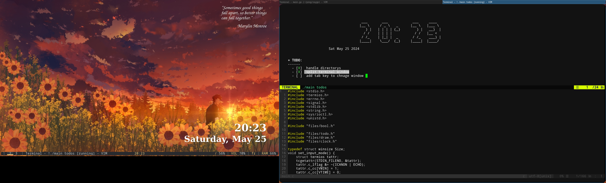

# Todoc

<p align="center">
  
</p>

# you have big project right ?
use todoc software that display all todos in your project and your project will become organzed

# Keywords
## after you choose directory project
```console
./main <directory>
```
### TAB : move to other file 
### q : quit program
### j : move down
### k : move up
### ENTER : mark "x" as complete

+ TODO :
    - [ ] ...
    - [X] ...
    - [ ] ...
